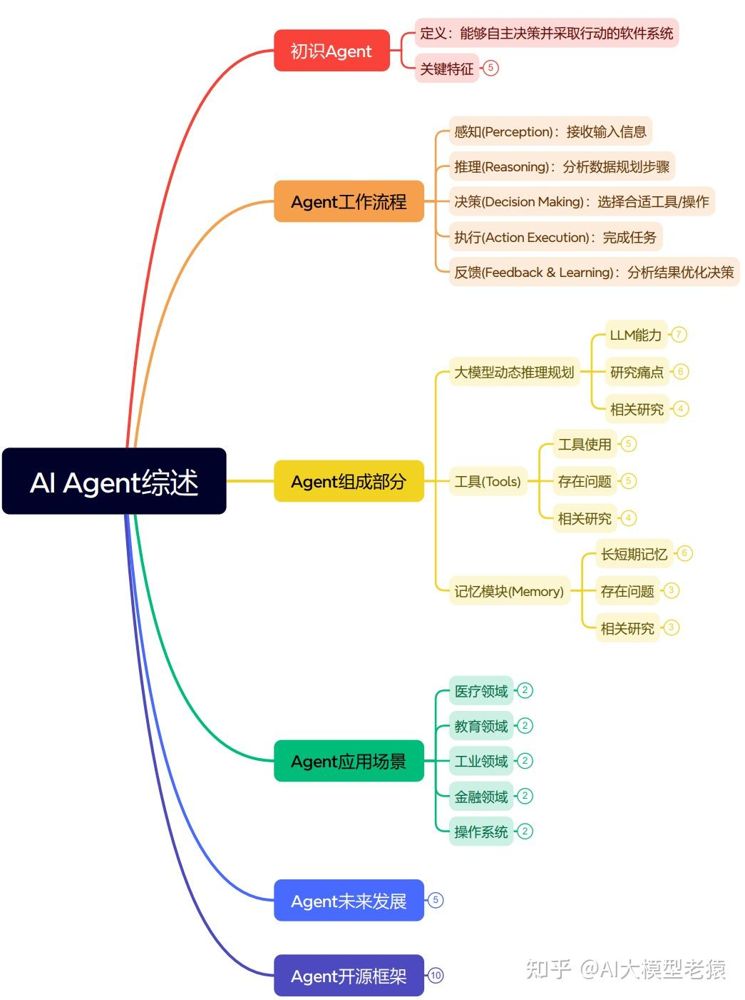

# Agent应用开发小组第一次会议

## 主要目标
1. 大模型/Agent
2. coze简介
3. 应用开发

## 一、Agent综述
- 文章主要看[🔗这篇讲解](https://mp.weixin.qq.com/s/QFJyS0TUCv-TT39isRLu3w?poc_token=HJmA4WijPDlBHpKxDx7IsJI1300GNgnbbcKoLbWA)

### 核心

- 记忆
    - 短期记忆：上下文窗口 ->限制
    - 长期记忆：外部数据库 ->精度
- 工具
    - 获取数据：如搜索工具
    - 执行命令：如计算，打开浏览器等
- 规划
    - 列表：列出todolist
    - 推理
- 反思
    - 评估
    - 反馈改进

### 技术
- 多智能体协同
- 提示词工程[🔗Prompt Engineering](https://www.promptingguide.ai/zh)
- RAG（Retrieval-Augmented Generation）检索增强生成

## 二、coze智能体开发讲解
### 入门建议
1. 先阅读[扣子官方文档](https://www.coze.cn/open/docs/guides/agent_overview)
    > 注意辨别是[🔗智能体开发平台](https://www.coze.cn/home)，不是扣子空间。
2. 上手做一个智能体应用先了解流程
3. 进一步进入到coze智能体模板商店，复制几个看看工作流怎么实现的
4. 进阶：创建标准智能体应用，自己设计工作流，过程中的设计思路很重要。

### coze实战教学
组件：
- 提示词
- 工作流
- 插件

1. 旅游规划智能体
    - 工具：
        - 查询天气预报
        - 查询地图
    - 记忆：
        - 知道用户要去哪里
2. 工作流
    - 按照编排的流程运行

## 三、应用开发示例
1. 开源框架
    - langchain
    - camel-ai
    - pydantic-ai
2. 代码示范